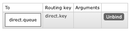

## RabbitMQ를 이용한 AMQP 라우팅 모델 실습

1. Spring AMQP의 핵심 개념(Producer, Consumer, Exchange, Queue) 학습

2. Direct, Fanout, Topic, Headers의 4가지 메시지 전달 방식 구현 및 테스트

## 기본 세팅
## 1. direct type 

exchange 이름과 라우팅 키가 동일해야함 1:1 매칭

## 2. Fanout

exhange만 보고 판단.
